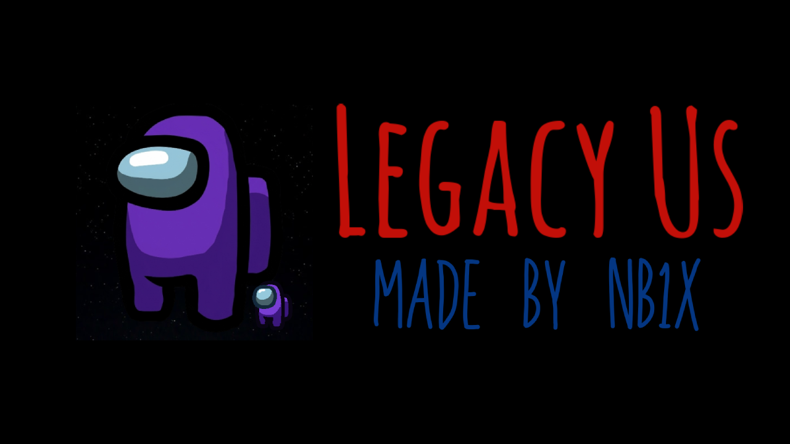

# Legacy Us

**Legacy Us** allows you to use Among Us old versions online with other players.

It is based on the v2020.11.17 version of Among Us and uses an [Impostor server](https://github.com/Impostor/Impostor).

If you want to host an Impostor server yourself for Legacy Us, you can see some instructions here: https://mirror-nb1x.2bd.net/website/setup-impostor-legacyus.html
